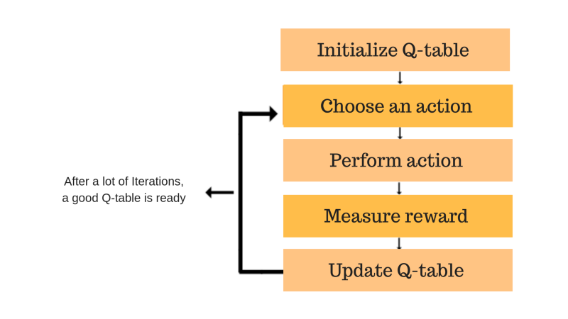

Week 4

**Q-learning**
 One of the reinforcement learning algorithms, which was introduced by Chris Watkins in 1989. It trains an agent to assign values to its possible actions based on its current state, **without requiring a model of the environment (model-free)**. It can handle problems with stochastic transitions and rewards without requiring adaptations. The core of the algorithm uses the Bellman equation and takes state(s) and action(a) as input. The equation simplifies the state values and state-action value calculation. The goal is to maximize the value function Q.

**Q-learning Algorithm Process**

 The Q table helps us to find the best action for each state.

**Limitations**
 This applies only to discrete action and state spaces. Discretization of these values leads to inefficient learning, largely due to the curse of dimensionality. 

Reference:
 https://en.wikipedia.org/wiki/Q-learning
 https://www.datacamp.com/tutorial/introduction-q-learning-beginner-tutorial
 https://www.freecodecamp.org/news/an-introduction-to-q-learning-reinforcement-learning-14ac0b4493cc/