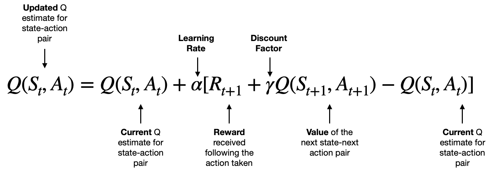

Week 5

**SARSA**
 State-Action-Reward-State-Action, a model-free reinforcement learning algorithm. This interacts with the environment and updates the policy based on actions taken, hence this is known as an on-policy learning algorithm.

*Q-learning is an off-policy algorithm, which means that it learns the optimal policy independently of the agent’s actions. In other words, Q-learning updates its Q-values based on the maximum possible reward from the next state, regardless of the action taken by the agent.*

*SARSA is an on-policy algorithm, which means it updates its Q-values based on the actual actions taken by the agent. It learns from the current policy being followed, which means the agent’s actions in the next state directly influence the Q-value updates.*

In SARSA, the Q-value is updated based on the action actually chosen in the next state, meaning the update depends on both the next state and the action taken according to the current policy.

**Limitations**
 Because of its on-policy nature, it can result in suboptimal policies and slower learning if the exploration strategy is not well-tuned or if the optimal path requires deviating significantly from the initially learned policy.

Reference:
 https://en.wikipedia.org/wiki/State%E2%80%93action%E2%80%93reward%E2%80%93state%E2%80%93action
 https://www.geeksforgeeks.org/differences-between-q-learning-and-sarsa/
 https://www.linkedin.com/pulse/one-minute-overview-sarsa-algorithm-saulius-dobilas/
 https://gymnasium.farama.org/environments/toy_text/taxi/
 https://www.datacamp.com/tutorial/sarsa-reinforcement-learning-algorithm-in-python